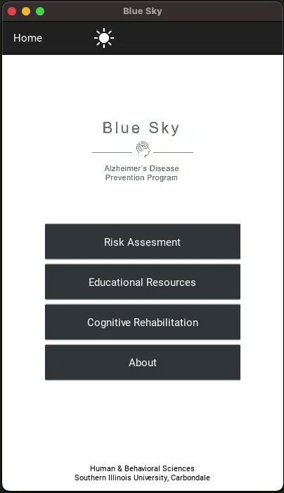

# BlueSky Alzheimers Research

## About

* A cross platform Android/iOS/Web application made for Department of Public Health at Southern Illinois University. 

* Part of a research study to determine whether a smartphone application is effective at identifying and helping people change behaviors that may lead to contracting Alzheimer's disease later in life.

* Built using Kivy for Python

### Demo

  

